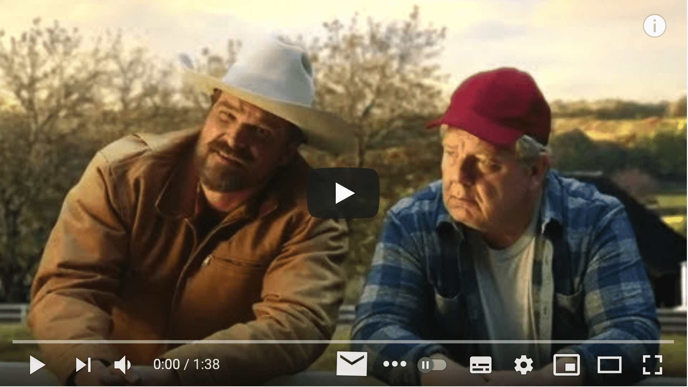
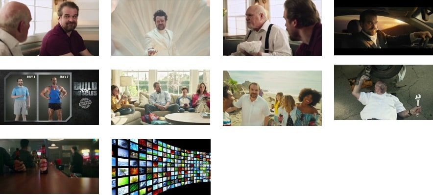
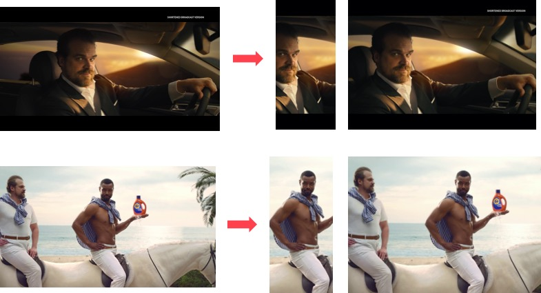
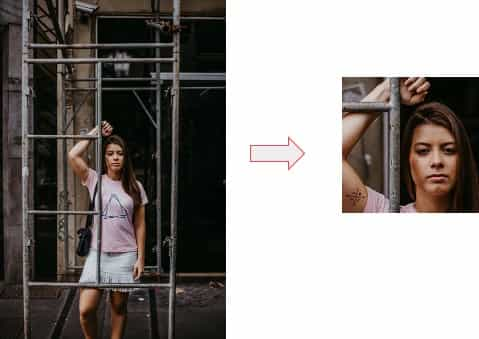
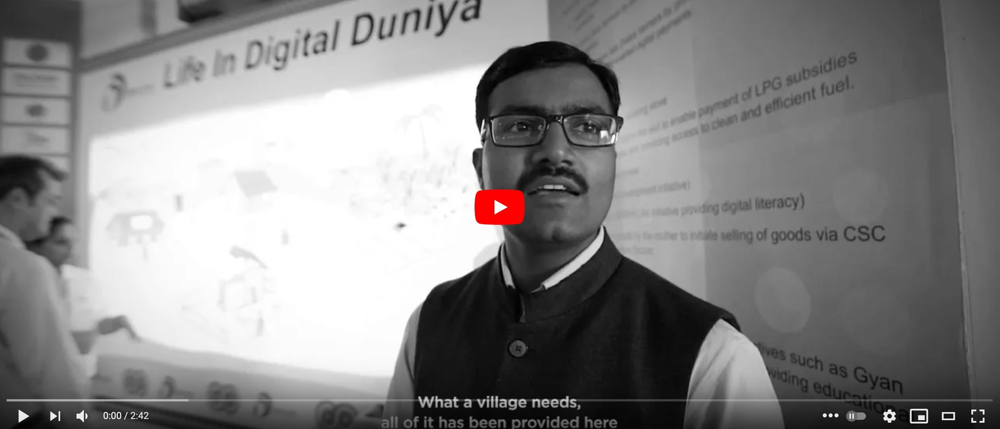
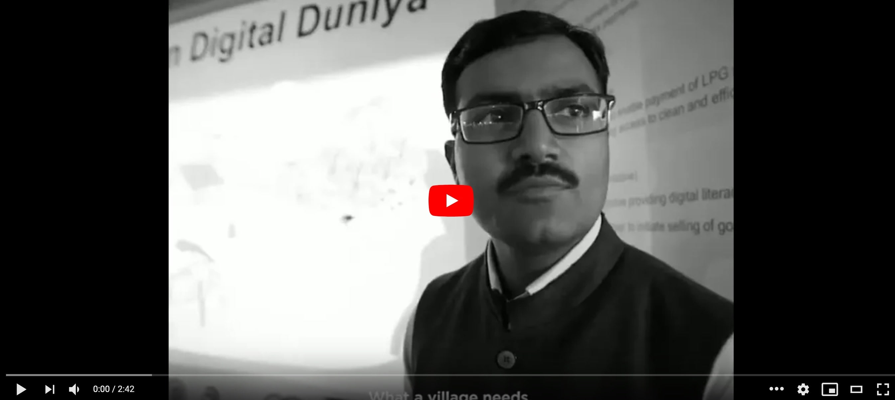

## **Katna**: Tool for automating video keyframe extraction, video compression, Image Autocrop and Smart image resize tasks


### Resources 
* Homepage and Reference: <https://katna.readthedocs.io/>

### Description

Katna automates the boring, error prone task of videos key/best frames extraction,
video compression and manual time consuming task of image cropping and resizing using ML.

In short, you may want to consider using Katna library if you have following tasks:

1. You have video/videos from who you want to extract keyframe/keyframes. 
   Please note Key-frames are defined as the representative frames of a video stream,
   the frames that provide the most accurate and compact summary of the video content.
   Take an example of this video and some of the top keyframes extracted using Katna. 
   
[](https://www.youtube.com/watch?v=zpaLHwwYxE8)

<p align="center"></p>




2. You have video/videos you want to compress down to smaller size. (e.g. You have video with let's say 1 GB Size but you want to compress it down as small as possible.)

3. You have image/images which you want to smartly resize to a target resolution.
   (e.g. 500x500, 1080p (1920x1080) etc.)



4. You have image/images from which you want to intelligently extract a crop with a target resolution.
   (e.g. Get a crop of size 500x500 from image of size 1920x1080)




5. You want to extract a crop of particular aspect ratio e.g. 4:3 from your input image/images.
   (e.g. Get a crop of aspect ratio 1:1 from image of resolution 1920x1080 (16:9 aspect ratio image))

6. You want to resize a video to particular aspect ratio e.g. 16:9 (Landscape), to lets say to 1:1 (square). Please note that this feature is currently **experimental** and needs additional compiling and configuration of google [mediapipe library](https://github.com/google/mediapipe). 


[](https://www.youtube.com/watch?v=-GFabrw3Csk)

<p align="center"></p>

[](https://www.youtube.com/watch?v=P0D5WPv63RY)


Katna is divided into two modules
* Video module.
* Image module.

Video Module:
-------------
This module handles the task(s) for key frame(s) extraction and video compression.

Key-frames are defined as the representative frames of a video stream, the frames that provide the most accurate and compact summary of the video content.

**Frame extraction and selection criteria for key-frame extraction**

1. Frame that are sufficiently different from previous ones using absolute differences in LUV colorspace
2. Brightness score filtering of extracted frames
3. Entropy/contrast score filtering of extracted frames
4. K-Means Clustering of frames using image histogram
5. Selection of best frame from clusters based on and variance of laplacian (image blur detection)

Video compression is handled using ffmpeg library. Details about which could be read in [Katna.video_compressor module](https://katna.readthedocs.io/en/latest/understanding_katna.html#katna-video-compressor) section.

Since version 0.8.0 of Katna we are extending smart resize features to videos with the help of Google's Mediapipe project. To know more about this please refer to documentation [Video Smart Resize using Katna]
(https://katna.readthedocs.io/en/latest/understanding_katna.html#katna-video-resize). Please note that this feature is an optional experimental feature. And might be subject to removal/modifications at later versions. Also you also need to install Google's Mediapipe library, Specially autoflip binary for this to work. Please refer to [Link](https://katna.readthedocs.io/en/latest/tutorials_video_smart_resize.html#tutorials-video-smart-resize) for how to install and configure mediapipe to be used with katna. 

Image Module:
-------------
This module handles the task(s) related to smart cropping and image resizing.

The Smart image cropping is happening in way that the module identifies the best part or the area where someone focus more
and interprets this information while cropping the image.

**Crop extraction and selection criteria**

1. Edge, saliency and Face detection features are detected in the input image
2. All the crops with specified dimensions are extracted with calculation of score for each crop wrt to extracted features
3. The crops will be passes through filters specified which will remove the crops which filter rejects

Similar to Smart crop Katna image module supports **Smart image resizing** feature. Given an input image it can resize image to target resolution with simple resizing if aspect ratio is same for input and target image. If aspect ratio is different than smart image resize will first crops biggest good quality crop in target resolution and then resizes image in target resolution. This ensures image resize without actually skewing input image. *Please not that if aspect ratio of input and output image are not same katna image_resize can lead to some loss of image content*

**Supported Video and image file formats**
##########################################

All the major video formats like .mp4,.mov,.avi etc and image formats like .jpg, .png, .jpeg etc are supported. 

More selection features are in developement pipeline

###  How to install

#### Using pypi
1) Install Python 3 
2) pip install katna

#### Install from source

1) Install git
2) Install Anaconda or Miniconda Python
3) Open terminal 
4) Clone repo from here https://github.com/keplerlab/Katna.git 
5) Change the directory to the directory where you have cloned your repo 
    ```
    $cd path_to_the_folder_repo_cloned
    ```
6) Create a new anaconda environment if you are using anaconda python distribution
    ```
    conda create --name katna python=3.7
    source activate katna
    ```

7) Run the setup:
    ``` 
    python setup.py install 
    ```    

#### Error handling and updates 
1) Since Katna version 0.4.0 Katna video module is optimized to use multiprocessing using python multiprocessing module. Due to restrictions of multiprocessing in windows, For safe importing of main module in windows system, make sure “entry point” of the program is wrapped in  __name__ == '__main__': as follows:
    ```
    from Katna.video import Video
    if __name__ == "__main__":
        vd = Video()
        # your code
    ```
    please refer to https://docs.python.org/2/library/multiprocessing.html#windows for more details.  

2) If input image is of very large size ( larger than 2000x2000 ) it might take a
long time to perform Automatic smart cropping.If you encounter this issue, consider changing down_sample_factor
from default 8 to larger values ( like 16 or 32 ). This will decrease processing time 
significantly. 

3) If you see "AttributeError: module 'cv2.cv2' has no attribute 'saliency'" error. Uninstall opencv-contrib
by running command "python -m pip uninstall opencv-contrib-python" and then again install it by running command 
    ```
    python -m pip install opencv-contrib-python
    ```

4) If you see "FileNotFoundError: frozen_east_text_detection.pb file not found". Open python shell and follow below commands.
    ```
    from Katna.image_filters.text_detector import TextDetector
    td = TextDetector()
    td.download()
    ```

5) On windows, ensure that anaconda has admin rights if installing with anaconda as it fails with 
the write permission while installing some modules.

6) If you get "RuntimeError: No ffmpeg exe could be found". Install ffmpeg on your system, and/or set the IMAGEIO_FFMPEG_EXE or FFMPEG_EXE environment variable to path of your ffmpeg binary.
Usually ffmpeg is installed using imageio-ffmpeg package, Check **imageio_ffmpeg-*.egg** folder inside your
**site-packages** folder, there should be a ffmpeg file inside binaries folder, check if this file has proper read/executable permission set and additionally set it's path to environment variable.

7) There is a known memory leak issue in Katna version 0.8.2 and less,
    when running bulk video keyframe extraction on Python version 3.6 and 3.7, 
    This is an multiprocessing bug observed only in Python 3.6 and 3.7. And is fixed in katna version 0.9 and above. If you are running Keyframe extraction code on large number of videos and facing memory issue, request you to upgrade your katna version to version 0.9 or above. If you still want to use older version of katna consider upgrading your python version to 3.8 or above.
### How to use Library

1) Refer to quickstart section in Katna Reference 
   from https://katna.readthedocs.io/

### Update: katna version 0.9.0
We have added writer framework to process data from Katna Video and Image module. This version
also fixes memory leak issue reported by [this](https://github.com/keplerlab/katna/issues/11) and
[this](https://github.com/keplerlab/katna/issues/12) issue.

#### The version introduces following breaking changes in the library API: ####
1. video.extract_video_keyframes and video.extract_video_keyframes_from_dir requires additional writer object. By default, KeyFrameDiskWriter is available to use from
Katna.writer module. Writer framework can be extended based on the requirement.

2. image.crop_image and image.crop_image_from_dir requires additional writer object.
By default, ImageCropDiskWriter is available to use from
Katna.writer module. Writer framework can be extended based on the requirement.

Refer documentation for the updated examples here: [Link](https://katna.readthedocs.io/)

### Update: katna version 0.8.2
This bug fix version fixes this issue: [Link](https://github.com/keplerlab/katna/issues/10)
### Update: katna version 0.8.1
Fixed an issue where in rare case where videos split using ffmpeg not readable and throwing exception [Link](https://github.com/keplerlab/katna/issues/9)
### Update: katna version 0.8.0
Added experimental support for autocrop/resize videos using Google's mediapipe
Autoflip code example.
### Update: katna version 0.7.1
Fixed bug where incorrect specification crops were returned by image_module crop_image and crop_image_from_dir method. 
### Update: katna version 0.7.0
Added support for video compression in Katna.video module.
### Update: katna version 0.6.0
Added support for smart image resize in Katna.image module.
### Update: katna version 0.5.0
In version 0.5.0 we have changed name of some of the public functions inside
for Katna.video module used for keyframe extraction,
1) extract_frames_as_images method is changed to extract_video_keyframes.
2) extract_frames_as_images_from_dir method is changed to extract_keyframes_from_videos_dir
### Attributions
1) We have used the SAD (Sum of absolute difference) code from [KeyFramesExtraction](https://github.com/amanwalia92/KeyFramesExtraction) project by Amanpreet Walia. Code released under MIT Licence.
2) We have used project [smartcrop.js](https://github.com/jwagner/smartcrop.js/) for Smart crop feature in Katna Image module.
3) For Experimental feature of Smartcrop/Resize in videos we are using help of [Google Mediapipe](https://github.com/google/mediapipe) [Autoflip](https://ai.googleblog.com/2020/02/autoflip-open-source-framework-for.html) framework.
4) Katna icon generated by [thenounproject](https://thenounproject.com/term/chef-knife/2082763/) icon developed by ProSymbols, US , In the Viking Elements Glyph Icons Collection licensed as Creative Commons CCBY.
